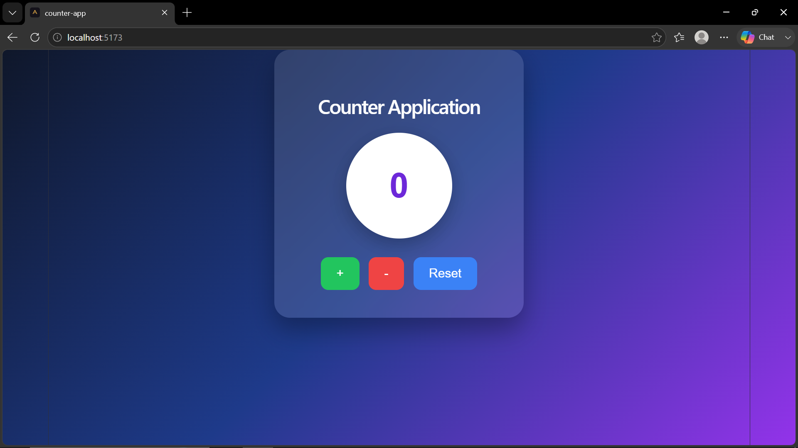

# 🔢 Counter App

A simple Counter App built with **React.js** that demonstrates state management using the **useState Hook**. Users can increment, decrement, and reset the counter with interactive buttons.

---

## 📖 Overview

The **Counter App** is a beginner-friendly React project that helps understand how React manages state using the `useState` Hook. It provides three basic operations:

- Increase the counter
- Decrease the counter (without allowing negative values)
- Reset the counter to its initial value

---

## ✨ Features

- ➕ Increment Counter
- ➖ Decrement Counter
- 🔄 Reset Counter
- 🚫 Prevents Negative Values
- ⚛️ Built with React Hooks
- 🎨 Simple and Clean User Interface

---

## 🛠️ Technologies Used

- React.js
- JavaScript (ES6)
- JSX
- CSS
- Vite

---

## 📂 Project Structure

COUNTER APPLICATION/
├── node_modules/
├── public/
│   ├── favicon.svg
│   └── icons.svg
├── screenshots/
│   └── counter-app.png
├── src/
│   ├── assets/
│   │   ├── hero.png
│   │   ├── react.svg
│   │   └── vite.svg
│   ├── Component/
│   │   └── Button.jsx
│   ├── App.css
│   ├── App.jsx
│   ├── index.css
│   └── main.jsx
├── .gitignore
├── eslint.config.js
├── index.html
├── package-lock.json
├── package.json
├── README.md
└── vite.config.js

---

## 🚀 Getting Started

### 1. Clone the Repository

```bash
git clone https://github.com/yourusername/counter-app.git
```

### 2. Navigate to the Project Folder

```bash
cd counter-app
```

### 3. Install Dependencies

```bash
npm install
```

### 4. Start the Development Server

```bash
npm run dev
```

Open your browser and visit:

```
http://localhost:5173
```

---

## 📸 Project Preview

The application includes:

- Counter Display
- Increment Button
- Decrement Button
- Reset Button



---

## 📚 React Concepts Used

- Functional Components
- React Hooks (`useState`)
- Event Handling
- State Management
- Conditional Logic
- JSX

---

## 💡 How It Works

- The counter starts with an initial value of **0**.
- Clicking **Increment** increases the counter by **1**.
- Clicking **Decrement** decreases the counter by **-1**, 
- Clicking **Reset** restores the counter to its initial value (**0**).

---

## 🔮 Future Improvements

- Add custom increment/decrement values
- Add dark mode
- Add minimum and maximum limits
- Disable buttons when limits are reached
- Add animations
- Store counter value using Local Storage
- Improve UI with Bootstrap or Tailwind CSS

---

## 👨‍💻 Author

**Ayush Dudhat**

- GitHub: https://github.com/ayushdudhat22
- LinkedIn: https://www.linkedin.com/in/ayush-dudhat-1b020937b/
- Presentation Link: https://drive.google.com/drive/folders/1zaEbnt368A2EY3EHqZNNkzuFqwaWrgFw

---

## 📄 License

This project is created for learning React and is free to use.

---

⭐ If you found this project helpful, consider giving it a ⭐ on GitHub!
